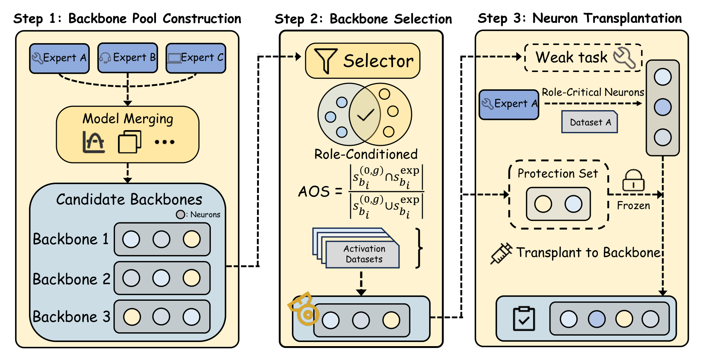
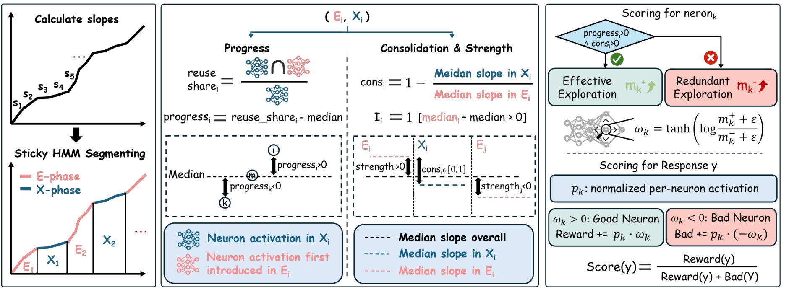
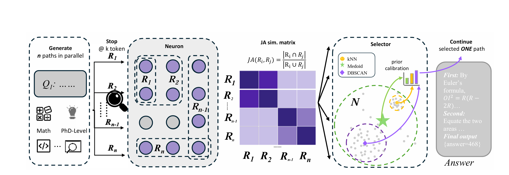
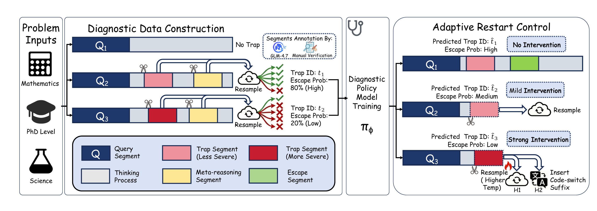

### About Me
I'm a third-year undergraduate at Fudan University, majoring in Computer Science. My research interests lie in natural language processing, with a focus on developing agentic large language models. Previously, I had the privilege of working with Prof. [Yixin Cao](https://taominer.github.io/) at Fudan University.

---

## 💼 Experience
- 2023–Present: Undergraduate Student, School of Computer Science, **Fudan University**

## 📝 Preprints and Publications

Preprint

  
<strong>ARM: Role-Conditioned Neuron Transplantation for Training-Free Generalist LLM Agent Merging</strong>

  <ul>
    <li><strong>Zhuoka Feng</strong>*, Kang Chen*, Sihan Zhao, Kai Xiong, Yaoning Wang, Minshen Yu, Junjie Nian, Changyi Xiao, Yixin Cao, Yugang Jiang</li>
    <li>2026</li>
    <li><a href="https://arkazhuo.github.io/ARM-homepage/"><strong>[Paper]</strong></a></li>
  </ul>

Preprint

  
<strong>NEX: Neuron Explore-Exploit Scoring for Label-Free Chain-of-Thought Selection and Model Ranking</strong>

  <ul>
    <li>Kang Chen*, <strong>Zhuoka Feng</strong>*, Sihan Zhao, Kai Xiong, Junjie Nian, Yaoning Wang, Changyi Xiao, Yixin Cao</li>
    <li>2026</li>
    <li><a href="https://arxiv.org/abs/2602.05805"><strong>[Paper]</strong></a></li>
  </ul>

ICML 2026 Spotlight

  
<strong>Do LLMs Signal When They're Right? Evidence from Neuron Agreement</strong>

  <ul>
    <li>Kang Chen*, Yaoning Wang*, Kai Xiong, <strong>Zhuoka Feng</strong>, Wenhe Sun, Haotian Chen, Yixin Cao</li>
    <li><strong>ICML 2026 Spotlight</strong></li>
    <li><a href="https://arxiv.org/abs/2510.26277"><strong>[Paper]</strong></a></li>
  </ul>

ACL 2026 Findings

  
<strong>Thinking Traps in Long Chain-of-Thought: A Measurable Study and Trap-Aware Adaptive Restart</strong>

  <ul>
    <li>Kang Chen*, Fan Yu*, Junjie Nian, Shihan Zhao, <strong>Zhuoka Feng</strong>, Zijun Yao, Heng Wang, Minshen Yu, Yixin Cao</li>
    <li><strong>ACL 2026 Findings</strong></li>
    <li><a href="https://aclanthology.org/2026.findings-acl.1930/"><strong>[Paper]</strong></a></li>
  </ul>

* Equal contribution.

## 🏅 Honors and Awards

- **National Scholarship**, 2023-2024
- First Prize, Chinese Mathematics Competitions
- Tang Zhongying Scholarship for Moral Education, 2023-2024，2024-2025
- Outstanding Student of Fudan University , 2023-2024，2024-2025(Top 10%)
